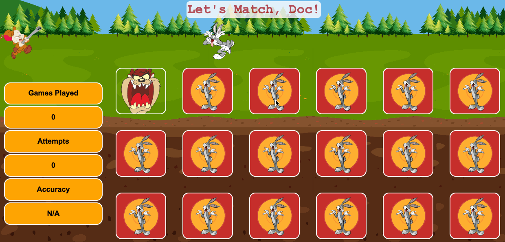

# Let's Match, Doc!

Don't let Elmer Fudd catch Bugs Bunny in this fully responsive Memory Match game! 7 misses off the bat and Bugs gets caught. With each match he runs towards safety.

## Live Demo

Play the game live at [https://www.match.sebtedesco.com](https://www.memorymatch.sebtedesco.com)

## Technologies Used

HTML5, CSS3, JavaScript (ES5), jQuery

## Features
- User can flip cards
- User can track games played
- User can track attempts on current game
- User can view accuracy on current game
- User can win if all cards matched before Elmer Fud catches Bugs Bunny
- User can lose if Elmor Fudd catches Bugs Bunny
- User can restart game after win or loss
    - Cards shuffle
    - Cards are all turned downard facing
    - Stats reset

## Preview



#### Getting Started

1. Clone the repository.

    ```shell
    git clone https://github.com/sebtedesco/memory-match.git
    ```

2. Go to `index.html` in Text Editor and open in browser
